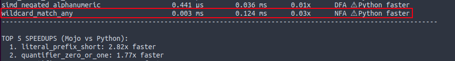
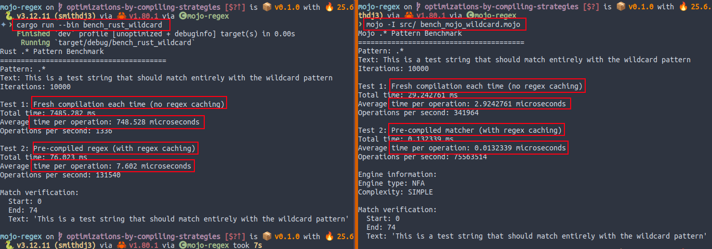
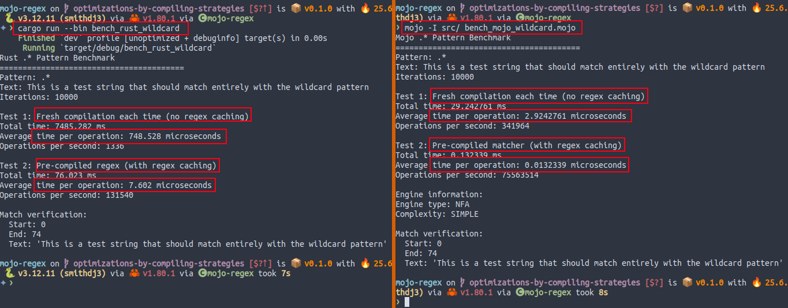

## Regex in Mojo

### Building Regular Expressions Engine with SIMD Optimization

<div style="text-align: center;">

</div>

---

# Contents

### Part 1: Introduction & Motivation
<!-- .element: class="fragment" -->

### Part 2: Architecture Overview
<!-- .element: class="fragment" -->

### Part 3: Performance Optimizations
<!-- .element: class="fragment" -->

### Part 4: Roadmap
<!-- .element: class="fragment" -->

### Part 5: Q&A
<!-- .element: class="fragment" -->

---

<!-- .slide: class="center-slide" -->
# Part 1: Introduction & Motivation

---

### What is mojo-regex?
- REGular EXpressions engine written in Mojo
- Familiar API to Python's `re` module
- Hybrid DFA/NFA Architecture
- SIMD optimizations for performance
- **Disclaimer**: Not a full regex implementation yet!

---

### Basic Usage

```mojo
from regex import match_first, findall, search

var result = match_first("hello", "hello world")
if result:
    print("Match found:", result.value().get_match_text())

var emails = findall(
    "[a-zA-Z0-9._%+-]+@[a-zA-Z0-9.-]+[.][a-zA-Z]{2,}",
    "Contact john@example.com or mary@test.org"
)
for m in emails:
    print("Email:", m.get_match_text())

var search_result = search("world", "hello world")
print("Search found:", search_result.value().get_match_text())
```

* Note: *The `match_first` should be just `match` but `match` is a reserved keyword in Mojo*

---

### Current Features

#### ✅ Implemented
- Basic elements: literals, wildcards (`a`, `.`)
- Character classes: `[a-z]`, `[^0-9]`
- Quantifiers: `*`, `+`, `?`, `{n}`, `{n,m}`
- Anchors: `^`, `$`
- Groups and alternation: `(abc)`, `a|b`

#### 🚧 In Progress
- Predefined classes: `\d`, `\w`, `\s`
- Non-capturing groups: `(?:...)`
- Case-insensitive matching
- Match replacement: `sub()`, `gsub()`

---

### Why Build a Regex Engine in Mojo?

**Just to solve a problem**
- At Smith.ai, needed a high-performance phone number parser
- Built smith-phonenums, based on python-phonenumbers
- Turns out regex was the bottleneck

**Alternatives**
- Import Python's `re` module from Mojo
- Parse numbers without regex

**The hard mode**
- Build a regex engine in Mojo "from scratch"
- Thanks to AI coding, entry barrier was much lower

---

<!-- .slide: class="center-slide" -->
# Part 2: Architecture Overview

---

### Architecture Overview

```
Input: "hello.*world"
        ↓
   📝 Lexer
        ↓
   🔣 Tokens: [ELEMENT(h), ELEMENT(e), ..., WILDCARD, ASTERISK, ...]
        ↓
   🌳 Parser
        ↓
   🎯 AST: RE → [ELEMENT(hello), WILDCARD(quantified), ELEMENT(world)]
        ↓
   🧠 Optimizer (Pattern Analysis)
        ↓
   🔀 HybridMatcher
      ├─ 🏎️ DFA Engine (simple patterns)
      └─ 🔄 NFA Engine (complex patterns)
        ↓
   📊 Match Results
```

---

### Component: Lexer & Parser

**Lexer** (`lexer.mojo`)
```mojo
fn scan(regex: String) -> List[Token]:
    # Tokenize: "a+" → [ELEMENT('a'), PLUS()]
```

**Parser** (`parser.mojo`)
```mojo
fn parse(tokens: List[Token]) -> ASTNode:
    # Build AST with proper precedence
    # Handle groups, alternation, quantifiers
```

---

### Components: Optimizer and Matcher

**Pattern Analysis** (`optimizer.mojo`)
```mojo
struct PatternAnalyzer:
    fn classify(self, ast: ASTNode[MutableAnyOrigin]) -> PatternComplexity:
        if ast.type == ASTNode.ELEMENT:
            return PatternComplexity.SIMPLE  # → DFA
        if self._has_groups_or_alternation(ast):
            return PatternComplexity.COMPLEX  # → NFA
        ...
```
**Matcher** (`matcher.mojo`)
```mojo
struct DFAMatcher(RegexMatcher):  # or NFAMatcher
    var engine: DFAEngine  # or NFAEngine

    fn match_first(self, text: String, start: Int = 0) -> Optional[Match]:
        return self.engine.match_first(text, start)

    fn match_next(self, text: String, start: Int = 0) -> Optional[Match]:
        return self.engine.match_next(text, start)
```

---

### Component: DFA and NFA Engines

- **Deterministic Finite Automaton**: Fast O(n) but limited features
- **Non-deterministic FA**: Full features but O(nm) with backtracking

```mojo
struct DFAEngine:  # or NFAEngine

    fn match_first(self, text: String, start: Int) -> Optional[Match]:
        ...
```

**Solution: Intelligent Routing**

```
Pattern → Analyzer → Simple? → DFA Engine (O(n))
                 ↓
              Complex? → NFA Engine (Full features)
```

---

<!-- .slide: class="center-slide" -->
# Part 3: Performance Optimizations

---

### ⚠️ Spoiler: Not even close to SOTA yet!

- Not a regex/SIMD expert. Just learning as I go.
- Benchmarking is hard.
- Performance is a Journey.
- Hard to trace copies and allocations.
  - Use `__call_location` in `__init__` or `__copyinit__` (thanks to @rd4com!)
  - Not easy in 3rd-party structs (e.g. `List`, `String`).
- AI generated code is not optimal (Python-like).
- Origins with recursive structs (e.g. AST) are difficult

---

### Performance Comparison vs Rust

| Pattern Type | Rust `regex` | mojo-regex | Speedup |
|--------------|-------------|------------|---------|
| literal_match_short | 0.298 μs | 0.415 ms | 0.00x ⚠️ |
| wildcard_match_any | 0.024 μs | 0.123 ms | 0.00x ⚠️ |
| quantifier_zero_or_more | 0.025 μs | 0.175 ms | 0.00x ⚠️ |
| ... | ... | ... | ... |
| **Best Case**: required_literal_short | 0.226 μs | 0.410 μs | 0.55x |
| **Close**: literal_prefix_short | 0.327 μs | 0.377 μs | 0.87x |

### Key Performance Insights
- No prefilters, no precompiled regexes.
<!-- .element: class="fragment" -->
- Rust is zero-copy, Mojo version is not yet.
<!-- .element: class="fragment" -->
- Rust claims use DFA for all inputs, Mojo uses hybrid DFA/NFA.
<!-- .element: class="fragment" -->

---

### Performance Comparison vs Python

| Pattern Type | Python `re` | mojo-regex | Speedup |
|--------------|-------------|------------|---------|
| literal_match_long | 0.095 ms | 0.400 ms | 0.24x ⚠️ |
| quantifier_zero_or_more | 0.315 ms | 0.188 ms | **1.68x** ✅ |
| quantifier_zero_or_one | 0.327 ms | 0.185 ms | **1.77x** ✅ |
| ... | ... | ... | ... |
| group_quantified | 0.063 ms | 0.211 ms | 0.30x ⚠️ |
| **Best Case**: literal_prefix_short | 0.816 μs | 0.289 μs | **2.82x** 🎉 |
| required_literal_short | 0.535 μs | 0.515 μs | 1.04x ≈ |

### Key Performance Insights
- Not competing with Python but with 25-year-old C library.
<!-- .element: class="fragment" -->
- Compiled patterns in a bytecode VM.
<!-- .element: class="fragment" -->

---

### Benchmarking Setup

* Used `Bench` module for benchmarking in Mojo.
* Equivalent custom code in Python/Rust that mimic `Bench`.
* Logic that output JSON and compare results.


<!-- .element: class="fragment" -->

---

#### Suspicious Points 1/3

* Optimized the .* pattern to bypass the engine.
* In the benchmarks, there was something off:

<!-- .element: class="fragment" -->

<!-- .element: class="fragment" -->

---

#### Suspicious Points 2/3

* When I tried specific scripts without the `Bench` module, the results were different.


<!-- .element: class="fragment" -->

---

#### Suspicious Points 3/3

* Even faster than Rust's!


<!-- .element: class="fragment" -->

---

### AST: Index-Based Architecture

**Traditional Approach:**
```mojo
struct ASTNode:
    var children: List[ASTNode]  # Copies everywhere!
```

**Our Approach:**
```mojo
struct Regex:
    var children_ptr: UnsafePointer[ASTNode]  # All nodes here
    var children_len: Int

struct ASTNode:
    var children_indexes: SIMD[DType.uint8, 256]  # Just indices!
    var regex_ptr: UnsafePointer[Regex]  # Back reference
```

🚀 **Benefits**: No copies, cache-friendly, SIMD potential

---

### Pattern Complexity Analysis

```mojo
struct PatternAnalyzer:
    fn classify(self, ast: ASTNode) -> PatternComplexity:
        # Analyze pattern features

        if self._is_literal_only(ast):
            return PatternComplexity.SIMPLE  # → DFA, so O(n)

        if self._has_simple_quantifiers(ast):
            return PatternComplexity.SIMPLE  # → DFA, so O(n)

        if self._has_groups_or_alternation(ast):
            return PatternComplexity.COMPLEX  # → NFA, so O(nm)
```
**Classification drives performance!**

---

### SIMD Matching

**The Challenge**: Check if character is in `[a-z]`

**Traditional Approach (one char at a time):**
```mojo
if char >= 'a' and char <= 'z':
```
**SIMD Approach:**
```mojo
struct CharacterClassSIMD(SIMDMatcher):
    var lookup_table: SIMD[DType.uint8, 256]  # 'a' to 'z' as 1s

    fn match_chunk[
        size: Int
    ](self, chunk: SIMD[DType.uint8, size]) -> SIMD[DType.bool, size]:
        var result = self.lookup_table._dynamic_shuffle(chunk)
        return result != 0
```

- 🚀 **16x/32x theoretical speedup!**
- 💡 **Key Insight**: SIMD has overhead - use wisely!

---

### Memory Optimizations

**Register-Passable Structs**
```mojo
@register_passable("trivial")
struct SIMDStringSearch:
    var pattern_length: Int  # 8 bytes
    var first_char_simd: SIMD[DType.uint8, 16]  # 16 bytes
    # Total: 24 bytes - fits in registers!
```

**Benefits:**
- ✅ No heap allocations
- ✅ No reference counting
- ✅ CPU register passing
- ✅ Better cache locality

---

### Caching Strategies

**Global Cache for Matchers, Regex, etc.**

```mojo
alias RangeMatchers = Dict[Int, RangeBasedMatcher]
alias _RANGE_MATCHERS_GLOBAL = ffi._Global[
    "RangeMatchers", RangeMatchers, _init_range_matchers
]
fn _init_range_matchers() -> RangeMatchers: ...

fn get_range_matcher(matcher_type: Int) -> RangeBasedMatcher:
    var matchers_ptr = _RANGE_MATCHERS_GLOBAL.get_or_create_ptr()
    try:
        return matchers_ptr[][matcher_type]  # try from cache
    except:
        # Create and cache the matcher
        var matcher = _create_range_matcher_for_type(matcher_type)
        matchers[matcher_type] = matcher
        return matcher

fn get_digit_matcher() -> RangeBasedMatcher:
    """Get cached digit matcher instance."""
    return get_range_matcher(SIMD_MATCHER_DIGITS)
```

🎯 **One allocation, used everywhere!**

---

### Compile-Time Optimizations

**Static ASCII Values**
```mojo
# Before: Runtime computation
if ord(char) >= ord('0') and ord(char) <= ord('9'):

# After: Compile-time constants
alias CHAR_ZERO = ord('0')
alias CHAR_NINE = ord('9')
if char_code >= CHAR_ZERO and char_code <= CHAR_NINE:
```

**Specialized Matchers**
```mojo
fn create_hex_matcher() -> NibbleBasedMatcher:
    """Optimized for [0-9a-fA-F] using bit operations."""
    return NibbleBasedMatcher()
```

---

<!-- .slide: class="center-slide" -->
# Part 4: Roadmap

---

### Future Roadmap

**Short term:**
- 🚀 More SIMD optimizations (Thanks @duck_tape!)
- ⚙️ Compile-time pattern optimization (WIP)
- 📝 Predefined character classes (`\d`, `\w`, `\s`)
- 🔄 Non-greedy quantifiers (`*?`, `+?`)
- 🎯 Named capture groups
- 🔧 Match replacement (`sub()`, `gsub()`)
- 🌍 Unicode support

**Long Term:**
- 👀 Lookahead/lookbehind assertions
- 🔗 Backreferences
- 🚀 GPU acceleration for parallel matching
- 📊 Integration with [rebar](https://github.com/BurntSushi/rebar) benchmarks.

---

## 📚 Resources

- **GitHub Repository** [github.com/msaelices/mojo-regex](https://github.com/msaelices/mojo-regex)

- **Installation Guide**
```bash
pixi add mojo-regex
```

- **Performance Tips** [docs/performance-tips.md](https://github.com/msaelices/mojo-regex/blob/main/docs/performance-tips.md)

- **Contributing Guide** [CONTRIBUTING.md](https://github.com/msaelices/mojo-regex/blob/main/CONTRIBUTING.md)

---

<!-- .slide: class="center-slide" -->
# Thank You! 🔥

Feel free to contribute, report issues, or share your use cases.

Or, for SME, just give me guidance... will implement it!

## Questions?

---
